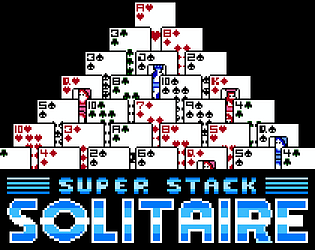

---

<h3 align="center">💀 WELCOME TO MY INTERNET PROFILE 💀</h3>

---

HELLO. MY REAL NAME IS JOE BUT ON THIS PROGRAMMING WEBSITE I AM NAMED **_W4FFL35_**. 

I HAVE BEEN INTERNETING FOR WHAT FEELS LIKE AN ETERNITY (30 YEARS) AND A GOOD PORTION OF THAT HAS BEEN AT A HIGHLY PROFESSIONAL LEVEL MAKING UNTOLD SUMS OF CASH FOR SMALL BUSINESS OWNERS AND MASSIVE CORPORATIONS ALIKE.

CREATING IS MY PASSION AND I ENJOY ENTERTAINING PEOPLE, SO I TRY TO PUT A LOT OF EFFORT INTO CREATING THINGS THAT ENTERTAIN PEOPLE. 

MAKES SENSE WHEN YOU THINK ABOUT IT. 

RECENTLY I HAVE DECIDED TO TAKE SOME TIME OFF AND PUT MAXIMUM EFFORT INTO CREATING VIDEO GAMES AND FUN APPS.

LIFE IS SHORT, ENJOY EVERYTHING YOU DO AT ALL TIMES.

---

The following is a small sampling of things I have created. I've made much more than this over the last 20 years, and will continue to make more.

As I dig through old code and find fun projects that I've worked on I will add those here, as well as anything new I choose to produce.

---

<h3 align="center">💀 CURRENTLY IN THE WILD 💀</h3>

---

<table>
    <tr>
        <td width="20%">

</td>
<td width="80%">
<h2>AI_IMAGE_BOT</h2>

         
This is a twitter bot that pays attention to trending tweets, generates relevant images using [min-dalle](https://github.com/kuprel/min-dalle),
and then confidently tweets them out to the world where they can one day become the target of someone's outrage.

</td>
</tr>
</table>

---

<h3 align="center">💀 CURRENTLY IN THE WORKS 💀</h3>

---

<table>
    <tr>
        <td width="20%">

</td>
<td width="80%">
<h2>Super Stack Solitaire</h2>
          
https://capsizegames.itch.io/super-stack-solitaire

An 8-bit style solitaire game with an arcade mode. Everything is made by myself using Unity3D, Famitracker (soundfx and music), and C#.

I'm currently trying to train an AI to play the game using reinforcement learning with the ML Agents library.

This game will be released by my company, [Capsize Games](https://capsize.gg).

</td>
</tr>
</table>

---

<h3 align="center">💀 SIDE PROJECTS, PROTOTYPES AND SHENANIGANS 💀</h3>

---

<table>
    <tr>
        <td width="20%">
          
        </td>
        <td>
          <h2>Wild West Poker</h2>
          <h3>Rank 14 out of 115 in May - June 2017 CGAJam</h3>
          <h4>Art:  Krystal + Joe</a>
          <h4>Programming, Sound, Menus, Controls:  <a href="https://github.com/Joe">Joe</a>
          <h4>Tech: C# / Unity3D</h4>
        <h4>Platforms</h4>
            
            
            
            </td>
    </tr>
    <tr>
        <td>
          <a href="https://www.youtube.com/watch?v=RPIqvvI1-_I"><image src="images/thumbs/markov.png" align="left" /></a>
        </td>
        <td>
          <h2>Markov chain generator</h2>

A markov chain generator built in C++ for UnrealEngine which generates music based on data it is fed. This demo is playing a loop based on the intro of `The Entertainer`. More songs will produce more unique and interesting music.  Used in project currently under development involving procedurally generated content.

          <h4>Tech: C++ / UnrealEngine 4</h4>
        </td>
    </tr>
    <tr>
        <td>
          <a href="https://www.youtube.com/watch?v=_WipnsTm6ho"><image src="images/thumbs/planet.png" align="left" /></a>
        </td>
        <td>
          <h2>Planet Generator</h2>
          <h3>Prototype</h3>

A prototype planet generator built in C# and HLSL for Unity3D. Planets are generated in realtime using compute shaders in HLSL. Generated data is passed to C# via buffers where it is applied to a quadrilateralized spherical cube mesh. This project has been abandoned.

          <h4>Tech: C# / HLSL / Unity3D</h4>
        </td>
    </tr>
    <tr>
        <td>
          <a href="https://www.youtube.com/watch?v=f9v8ZL0Mlso"><image src="images/thumbs/trueFPP.png" align="left" /></a>
        </td>
        <td>
          <h2>True FPS + Chaos Destruction</h2>

True First Person Perspective view (same technique as seen in Battlefield and Call of Duty) + Chaos destruction for an upcoming game

          <h4>Tech: C++ / UnrealEngine 4.26-Chaos</h4>
        </td>
    </tr>
    <tr>
        <td>
          <a href="https://www.youtube.com/watch?v=y9Klg-gBh-M"><image src="images/thumbs/rtsprototype.png" align="left" /></a>
        </td>
        <td>
          <h2>RTS</h2>
          <h3>Prototype</h3>

Prototype for a 2d RTS in the style of Warcraft 2. Video showcases selecting units, assigning tasks, resource gathering, map creation and maze solving. Uses a custom A* algorithm.

          <h4>Tech: C# / Unity3D</h4>
        </td>
    </tr>
</table>

---

<h3 align="center">💚 SOME OF THE TECHNOLOGY I FREQUENT 💚</h3>

---

<table>
  <tr>
    <th>
      <h4>🎮 VIDEO GAMES 🎮</h4>
    </th>
  </tr>
  <tr>
    <td width="100%" align="center">
      
      
      
      
      
    </td>
  </tr>
  <tr>
    <th>
      <h4>🕸️ WEB DEV 🕸️</h4>
    </th>
  </tr>
  <tr>
    <td align="center">
      
      
      
      
      
      
      
      
      
      
      
      
      
      
      
      
      
    </td>
  </tr>
  <tr>
    <th>
      <h4>💻 MISC SOFTWARE 💻</h4>
    </th>
  </tr>
  <tr>
    <td align="center">
      
      
      
      
      
      
    </td>
  </tr>
  <tr>
    <th>
      <h4>💻 OPERATING SYSTEMS 💻</h4>
    </th>
  </tr>
  <tr>
    <td align="center">
      
      
      
    </td>
  </tr>
</table>
