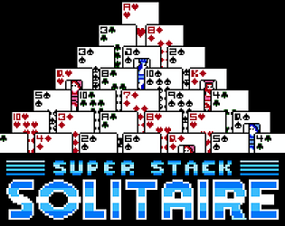

---

# Public portfolio

This is a constantly changing list of things I have worked on over the years. 

It is not a comprehensive list. Many of the projects I have worked on were under NDA and 
are only relevant to future potential employers. These will be listed in a separate private portfolio.

---

<h2>Active projects</h2>

This is a list of my actively maintained projects.

---

<table width="100%">
    <tr width="100%">
        <td width="30%">

</td>
<td width="80%">
<h2>node-maze-generator</h2>

[NPM](https://www.npmjs.com/package/node-maze-generator) [Github](https://www.github.com/w4ffl35/node-maze-generator)

Generate perfect mazes with Node using a growing tree algorithm.

</td>
</tr>
</table>

<table width="100%">
    <tr width="100%">
        <td width="30%">

</td>
<td width="80%">
<h2>JS-KTC</h2>

[NPM](https://www.npmjs.com/package/js-ktc) [github](https://www.github.com/w4ffl35/js-ktc)
         
Keyword Transposition Cipher javascript library. An extensible implementation of a basic Keyword Transposition Cipher, including Jest tests. 

This repository was included in the [2020 Github Arcitic Code Vault](https://archiveprogram.github.com/).

</td>
</tr>
</table>

<table>
    <tr>
        <td width="30%">

</td>
<td width="80%">
<h2>AI Image bot</h2>

[twitter](https://twitter.com/robo_pictures)
         
This is a twitter bot that pays attention to trending tweets, generates relevant images using the Twitter API and the Dalle-mini model (thanks to [min-dalle](https://github.com/kuprel/min-dalle)),
and then confidently tweets them out to the world where they can one day become the target of someone's outrage.

</td>
</tr>
</table>

---

<h2>The following projects are under active development</h2>

---

<table>
    <tr>
        <td width="30%">

</td>
<td width="80%">
<h2>Super Stack Solitaire</h2>
          
[itch.io](https://capsizegames.itch.io/super-stack-solitaire)

An 8-bit style solitaire game with an arcade mode. Everything is made by myself using Unity3D, Famitracker (soundfx and music), and C#.

I'm currently trying to train an AI to play the game using reinforcement learning with the ML Agents library.

This game will be released by my company, [Capsize Games](https://capsize.gg).

</td>
</tr>
</table>

---

<h2>Old projects</h2>

These are projects that are currently inactive but may be of interest to viewers.

---

<table>
    <tr>
        <td width="30%">
          
        </td>
        <td>
          <h2>Wild West Poker</h2>

[itch.io](https://capsizegames.itch.io/wild-west-poker)

Released for the CGI game jam this game was developed in 2 weeks.

I have continued to maintain it since its release and will be working on a new version this year.

<strong>Rank 14 out of 115 in May - June 2017 CGAJam</strong>

<h4>Art:  Krystal + Joe</a>
<h4>Programming, Sound, Menus, Controls:  Joe
<h4>Tech: C# / Unity3D</h4>
<h4>Platforms</h4>

</td>
    </tr>
    <tr>
        <td>
          <a href="https://www.youtube.com/watch?v=RPIqvvI1-_I"><image src="images/thumbs/markov.png" align="left" /></a>
        </td>
        <td>
          <h2>Markov chain generator</h2>

A markov chain generator built in C++ for UnrealEngine which generates music based on data it is fed. This demo is playing a loop based on the intro of `The Entertainer`. More songs will produce more unique and interesting music.  Used in project currently under development involving procedurally generated content.

          <h4>Tech: C++ / UnrealEngine 4</h4>
        </td>
    </tr>
    <tr>
        <td>
          <a href="https://www.youtube.com/watch?v=_WipnsTm6ho"><image src="images/thumbs/planet.png" align="left" /></a>
        </td>
        <td>
          <h2>Planet Generator</h2>
          <h3>Prototype</h3>

A prototype planet generator built in C# and HLSL for Unity3D. Planets are generated in realtime using compute shaders in HLSL. Generated data is passed to C# via buffers where it is applied to a quadrilateralized spherical cube mesh. This project has been abandoned.

          <h4>Tech: C# / HLSL / Unity3D</h4>
        </td>
    </tr>
    <tr>
        <td>
          <a href="https://www.youtube.com/watch?v=f9v8ZL0Mlso"><image src="images/thumbs/trueFPP.png" align="left" /></a>
        </td>
        <td>
          <h2>True FPS + Chaos Destruction</h2>

True First Person Perspective view (same technique as seen in Battlefield and Call of Duty... I think) + Chaos destruction for an upcoming game

          <h4>Tech: C++ / UnrealEngine 4.26-Chaos</h4>
        </td>
    </tr>
    <tr>
        <td>
          <a href="https://www.youtube.com/watch?v=y9Klg-gBh-M"><image src="images/thumbs/rtsprototype.png" align="left" /></a>
        </td>
        <td>
          <h2>RTS</h2>
          <h3>Prototype</h3>

Prototype for a 2d RTS in the style of Warcraft 2. Video showcases selecting units, assigning tasks, resource gathering, map creation and maze solving. Uses a custom A* algorithm.

          <h4>Tech: C# / Unity3D</h4>
        </td>
    </tr>
</table>
